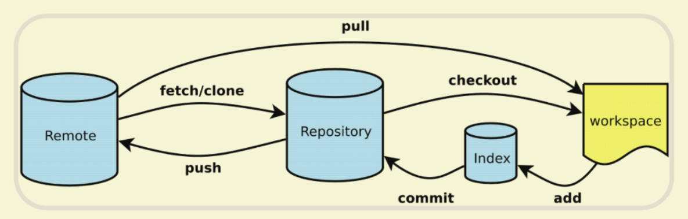

Git使用方法

# Git

## 基本介绍



- workspace: 工作区域，就是你平时存放项目代码的地方。
- Index/Stage：暂存区域，用于临时存放你的改动，事实上它只是一个文件，保存即将提交的文件列表信息。
- Repository：Git本地仓库，就是安全存放数据的位置，这里边有你提交的所有版本的数据。其中，HEAD 指向最新放入仓库的版本。
- Remote：Git远程仓库，如GitHub、Gitee等

Git 管理的文件有三种状态：已修改（modified）、已暂存（staged）和已提交（committed），分别对应workspace、index、repository

## 本地操作

| 命令   | 功能              |
|:---------   |:-------------|
| git init    | 初始化仓库  |
|git status	|查看当前仓库状态|
|git log	|查看提交历史|
| git config | 配置信息 |
| git add .	| 添加所有更改到暂存区|
| git add \<file>	| 添加指定文件到暂存区|
| git commit -m "提交描述"| 将暂存区文件添加到本地仓库|

### 初始化一个仓库
```cmd
git init
```

### 配置用户信息（Git 首次安装必须设置一下用户签名，否则无法提交代码。之后无需再次配置）
```cmd
git congif --global user.name "Your Name"
git config --global user.email "youremail@example.com"
```

- 签名的作用是区分不同操作者身份，用户的签名信息在每一个版本的提交信息中能够看到，以此确认本次提交是谁做的。
- 这里设置用户签名和将来登录 GitHub（或其他代码托管中心）的账号没有任何关系

### Workspace -> Index
```cmd
git add <filename>  # 添加指定文件到暂存区
git add .           # 添加所有更改到暂存区
```

### Index -> Repository
```cmd
git commit -m "提交描述" # 提交暂存区的文件快照到本地仓库
```

- 使用命令git add <file>，可反复多次使用，添加多个文件至暂存区；最后在使用命令git commit -m <message>一次性提交至本地仓库。

通过以上命令，即可创建一个仓库并提交文件。

## 远程操作

| 命令   | 功能          |
|:---------   |:-------------|
| git remote add origin \<repo_url>	| 关联远程仓库|
|git pull origin \<branch-name>	| 拉取远程更新并合并|
| git push origin \<branch-name>	| 推送本地分支到远程|
| git push -u origin \<branch-name>	|推送并设置 upstream（后续可直接 git push）|
| git clone \<repo_url> | 克隆远程仓库|

### 克隆并创建分支
```cmd
git clone <远程仓库地址> -b <分支名> # 会在当前目录下创建一个目录
```

### 拉取远程仓库的变化（GitHub->本地）
```cmd
git pull origin <分支名> # 表示将代码从远程仓库的<分支名>分支，拉取到本地仓库
```

- 分支名默认为master 或 main
- origin 为本地仓库指向远程仓库的指针

### 推送到远程仓库（本地->GitHub）
```cmd
git push origin <分支名> # 表示将代码从本地仓库，拉取到远程仓库的<分支名>分支
```

## Git分支模型

| 命令   | 功能              |
|:---------   |:-------------  |
| git branch	|查看本地分支|
| git branch -r	|查看远程分支|
| git branch -a	|查看所有分支（本地 + 远程）|
| git branch 新分支名	|创建新分支（不会切换）|
| git checkout -b 新分支名 / git switch -c 新分支名	|创建并切换新分支|
| git checkout 分支名 / git switch 分支名|	切换分支|
| git branch -d 分支名|	删除本地分支（已合并）|
| git branch -D 分支名|	强制删除本地分支（未合并）|
| git push origin --delete 分支名|	删除远程分支|
| git branch -m 旧分支名 新分支名|	重命名分支|
| git merge 分支名|	合并分支（用于将一个分支的更改合并到当前分支）|

### 创建远程分支的方法
#### 1. 本地创建分支并推送到远程
```
git branch feature-xyz  # 创建 feature-xyz 分支
git switch feature-xyz   # 切换到新分支（或使用 `git checkout feature-xyz`）
git push -u origin feature-xyz
```

#### 2. 直接在 GitHub 上创建分支
```
打开 GitHub 仓库，进入 "Branches" 选项卡
点击 "New Branch"，输入分支名称（如 feature-xyz）
创建成功后，本地同步该分支：
git fetch origin
git switch feature-xyz  # 切换到远程新分支
git pull origin feature-xyz  # 确保本地最新
```

## 简单实例

### 1.初始化本地仓库
```
cd E:
mkdir my_repository
cd E:/my_repository
git init
```

### 2.在GitHub创建一个新的仓库
```
git remote add origin <远程仓库地址>
    （例如:  https://github.com/your-username/your-repository-name.git        Https方式
             git@github.com/your-username/your-repository-name.git            SSH方式）
git pull origin main --rebase        # 先远程仓库同步到本地仓库，防止报错
```

- origin 为本地仓库指向远程仓库的指针， git remote add origin <远程仓库地址>即将origin变量与远程仓库地址进行链接
- main或master为远程仓库的分支名称
- main和master其实是一样的，git前期默认分支名为master，后期默认分支名改为main（因为master有sm的含义）

### 3.本地仓库文件管理
```
git add .
git commit -m "提交描述"       # -m 参数不可省略
```

### 4.将本地仓库连接到GitHub仓库
```
git push origin main
```

### 5.更新本地文件后，需重复3和4操作完成远程同步
